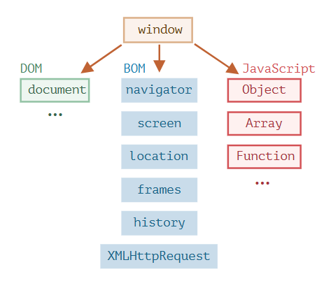

# Browser environment, specs
There is a "root" object called <mark>window</mark>. It has two roles:
- First, it is a <mark>global object</mark> for Javascript Code.
- Second, it represents the <mark>browser window</mark> and provides methods to control it.

    

## DOM (Document Object Model)
Represnts all page content as an <mark>object</mark> that can be modified.
That object is called <mark><ins>***document***</ins></mark>. The document is the main entry point to the page. We can change or create anything on the page by using it.

> [!NOTE]
> Non-Browser instruments also uses DOM too.  
>   - exp : Server-side script that download HTML pages and process them can also use the DOM.

## BOM (Browser Object Model)
Represents additional objects provided by the browser(host environment) for working with everything <mark>except the document</mark>.
