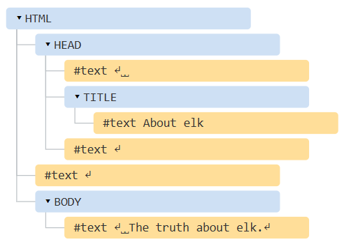
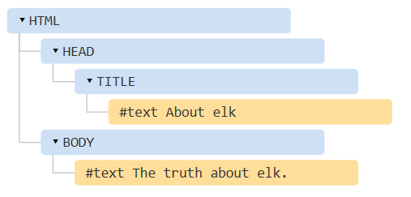

# DOM Tree

According to the DOM, every HTML tag is an object.<br><br><br>


<!-- Example - 1 -->
### Example - 1
```js
<!DOCTYPE HTML>
<html>
<head>
  <title>About elk</title>
</head>
<body>
  The truth about elk.
</body>
</html>
```

<br>

- Tags are element nodes. `<html>` is at the root, then `<head>` and `<body>` are its children, etc.
- The text inside elements forms text nodes, labelled as #text. A text node contains only a string. It may not have children and is always a leaf of the tree.

> [!NOTE]
> Please note the special characters in text nodes:
> - a newline : ↵ (in JavaScript known as \n).
> - a spaces : ␣ <br>
> 
> Spaces and newlines are totally valid characters, like letters and digits. They form text nodes and become a part of the DOM. So, for instance, in the example above the `<head>` tag contains some spaces before `<title>`, and that text becomes a #text node (it contains a newline and some spaces only).

> [!NOTE]
> There are only two top-level exclusions:
> - Spaces and newlines before `<head>` are ignored for historical reasons.
> - If we put something after `</body>`, then that is automatically moved inside the body, at the end, as the HTML spec requires that all content must be inside <body>. So there can’t be any spaces after `</body>`.


<!-- Example - 2 -->
<br><br>
### Example - 2
If there are no spaces or newline(just like any character) in the document, then there won’t be any text-node for them.

```js
<!DOCTYPE HTML>
<html><head><title>About elk</title></head><body>The truth about elk.</body></html>
```




<!-- Important Note -->
<br><br>
> [!IMPORTANT]
> Everything in HTML, even <mark>comments</mark>, becomes a part of the DOM.