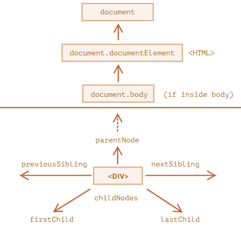

# DOM Navigation
All operations on the DOM start with the <mark><ins>**document**</ins></mark> object. That's the main "entry point" to the DOM.From it we can access any node.<br><br>
The topmost tree nodes are available directly as document properties:

<figure>
    
    <figcaption>
        <i>Picture of links that allow for travel between DOM nodes.</i>
    </figcaption>
</figure>


## document.documentElement, document.head & document.body
The topmost document node is <mark><ins>**document.documentElement**</ins></mark>. That’s the DOM node of the `<html>` tag.

The `<head>` tag is available as <mark><ins>**document.head**</ins></mark>.

The `<body>` tag is available as <mark><ins>**document.body**</ins></mark>.


## childNodes, firstChild and lastChild
The <mark><ins>**elem.childNodes**</ins></mark> returns a list of all child nodes (called as `NodeList`) including all text-nodes as-well

```html
<!DOCTYPE html>
<html>
<body>
  <div>Begin</div>
  <ul>
    <li>
      <b>Information</b>
    </li>
  </ul>
  <script>
    let body_child_nodes = document.body.childNodes;
    
    console.log(body_child_nodes); // op : NodeList(6) [text, div, text, ul, text, script]

    console.log(body_child_nodes[0]); // op : #text
    console.log(body_child_nodes[1]); // op : <div>Begin</div>


    //traversing through each element of NodeList
    for(elem of body_child_nodes){
      console.log(elem);
    }

    for(let i = 0; i < body_child_nodes.length; i++){
      console.log(body_child_nodes[i]); // op : 
    }

  </script>
</body>
</html>
```

<mark><ins>**elem.firstChild**</ins></mark> & <mark><ins>**elem.lastChild**</ins></mark> give the fast access to the first and last children of an element.

```html

<body>
  <div>Begin</div>
  <ul>
    <li>
      <b>Information</b>
    </li>
  </ul>
  <script>
    console.log(document.body.firstChild) //op : #text
    console.log(document.body.lastChild) //op : <script> < /script>

    console.log(document.body.childNodes[0] ===  document.body.firstChild); // op : true
    console.log(document.body.childNodes[document.body.childNodes.length - 1] ===  document.body.lastChild); // op : true
  </script>
</body>

```

 - There’s also a special function <mark><ins>**elem.hasChildNodes()**</ins></mark> to check whether there are any child nodes.
  ``` html
  <body>
    <div>Begin</div>
    <script>
        console.log(document.body.hasChildNodes()) //op : true
        console.log(document.body.firstChild.hasChildNodes()) //op : false
    </script>
</body>
  ```


## parentNode, nextSibling, previousSibling
Siblings are nodes that are children of the same parent.
- `<body>` is said to be the “next” or “right” sibling of `<head>`
- `<head>` is said to be the “previous” or “left” sibling of `<body>`.

```js
// parent of <body> is <html>
alert( document.body.parentNode === document.documentElement ); // true

// after <head> goes <body>
alert( document.head.nextSibling ); // HTMLBodyElement

// before <body> goes <head>
alert( document.body.previousSibling ); // HTMLHeadElement
```


<br><br>
# Element-only Navigation
Navigation properties listed above refer to all nodes(element, text and comment nodes).

we have also similar properties for only <mark>element nodes</mark> : 
- <mark><ins>**children**</ins></mark> : only those children that are element nodes
- <mark><ins>**firstElementChild**</ins></mark>, <mark><ins>**lastElementChild**</ins></mark> – first and last element children.
- <mark><ins>**previousElementSibling**</ins></mark>, <mark><ins>**nextElementSibling**</ins></mark> – neighbor elements.
- <mark><ins>**parentElement**</ins></mark> – parent element.


<br><br>
> [!NOTE]
> ## Don’t use for..in to loop over *HTMLCollections* or *NodeList*
> - *HTMLCollections* or *NodeList* are iterable using `for..of`
> - The `for..in` loop iterates over all <ins>enumerable properties</ins>. And *HTMLCollections* or *NodeList* have some “extra” rarely used properties that we usually do not want to get:


<br><br>
> [!NOTE]
> ```js
> alert( document.documentElement.parentNode ); // document
> alert( document.documentElement.parentElement ); // null
>```
>The reason is that the root node `document.documentElement` (`<html>`) has `document` as its parent. But `document` is not an element node, so `parentNode` returns it and parentElement does not.


<br><br>
> [!NOTE]
> A script cannot access an element that doesn’t exist at the moment of running.
> ```html
> <html>
> <head>
>   <script>
>     alert( "From HEAD: " + document.body ); // null, there's no <body> yet
>   </script>
> </head>
> 
> <body>
> 
>   <script>
>     alert( "From BODY: " + document.body ); // HTMLBodyElement, now it exists
>   </script>
> 
> </body>
> </html>
> ```
> <mark>In the DOM, the null value means “doesn’t exist” or “no such node”.</mark>
