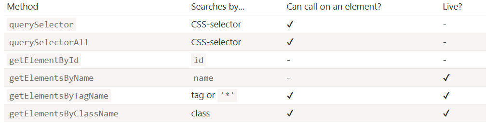

DOM navigation properties are great when elements are close to each other. What if they are not? How to get an arbitrary element of the page?

## Selecting Elements by ID
- <mark><ins>***document.getElementById(id)***</ins></mark> : Retrieves an element by its unique `id`
```js
let elem = document.getElementById('elem');
elem.style.background = 'red';
//the background color of the HTML element with the ID 'elem' will change into red.
```
> [!CAUTION]
> ### Only document.getElementById, not anyElem.getElementById.
> The method getElementById can be called only on document object. It looks for the given id in the whole document.


##  Selecting Elements by Class-Name / Tag-Name / Named-Attributes
- <mark><ins>***getElementsByTagName(tag)***</ins></mark>: Returns `live` `HTMLCollection` of elements by tag.
- <mark><ins>***getElementsByClassName(className)***</ins></mark>: Returns `live` `HTMLCollection` of elements by class.
- <mark><ins>***getElementsByName(name)***</ins></mark>: Returns `live` `nodeList` of elements with matching name attribute. `Only on the document object`.
#### exp :
```html
    <body>
        <div class="cls_1">div1</div>
        <p class="cls_2">p1</p>
        <div class="cls_2">div2</div>
        <input type="text" name="full_name" class="cls_1">
        <p class="cls_1">p3</p>
        <input type="text" name="full_name" class="cls_2">
        
        <script>
            console.log(document.body.getElementsByTagName('p'));//HTMLCollection of all 'p' tagged elements
            console.log(document.body.getElementsByClassName("cls_1"));//HTMLCollection of all elements with className 
            console.log(document.getElementsByName("full_name"));//NodeList of named-attributes elements
        </script>
    </body>
```


## Selecting Elements with CSS Selectors
- <mark><ins>***querySelector(css)***</ins></mark> : Returns the first matching element.
- <mark><ins>***querySelectorAll(css)***</ins></mark> : Returns all matching elements as a static NodeList (doesn’t update dynamically).
  

#### exp :
```html
<body>
    <button class="bttn">Button - 1</button>
    <button class="bttn">Button - 2</button>

    <script>
        console.log(document.querySelector("button")); //only first matching result i.e. 'Button - 1'
        console.log(document.querySelectorAll("button")); //NodeList of all matching result.
    </script>
</body>
```

#### exp : 
```html
<ul>
  <li>The</li>
  <li>test</li>
</ul>
<ul>
  <li>has</li>
  <li>passed</li>
</ul>
<script>
  let elements = document.querySelectorAll('ul > li:last-child');

  for (let elem of elements) {
    alert(elem.innerHTML); // "test", "passed"
  }
</script>
```
> [!NOTE]
>   Pseudo-classes in the CSS selector like `:hover` and `:active` are also supported. For instance, document.querySelectorAll(':hover') will return the collection with elements that the pointer is over now (in nesting order: from the outermost <html> to the most nested one).


## Checking & Finding Related Elements
- <mark><ins>***matches(css)***</ins></mark> : checks if elem matches the given CSS-selector. It returns `true` or `false`.
- <mark><ins>***closest(css)***</ins></mark> : Finds the nearest ancestor (including itself) matching the selector.


#### exp : 
```html
<button class="bttn">Button - 1</button>
<button class="bttn">Button - 2</button>

<script>
    //true : if 'Button-1' Hovered.
    //false : id 'Button-1' not Hovered. 
    console.log(document.querySelectorAll("button")[0].matches(":hover"));

    //false : in any case. Becausse for button-2 hover-styling is not applied
    console.log(document.querySelectorAll("button")[1].matches(":hover"));
</script>
```


## Live Collection
All methods "getElementsBy*" return a live collection. Such collections always reflect the current state of the document and “auto-update” when it changes.

#### exp : 
```html
<div>First div</div>

<script>
  let divs = document.getElementsByTagName('div');
  alert(divs.length); // 1
</script>

<div>Second div</div>

<script>
  alert(divs.length); // 2
</script>
```


## Summary
