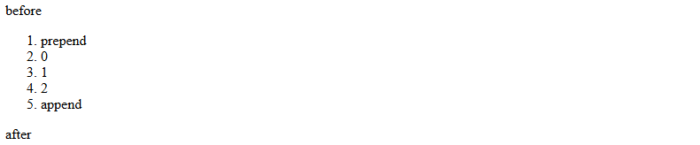
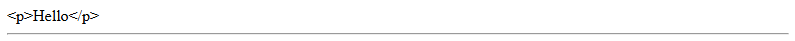
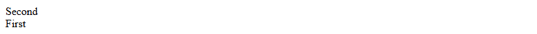
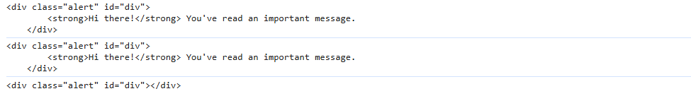

# Modifying the document


## Creating an element
- <mark><ins>**document.createElement(tag)**</ins></mark> : Creates a new element node with the given tag.
  ```js
  let div = document.createElement('div');
  ```
- <mark><ins>**document.createTextNode(text)**</ins></mark> : Creates a new text node with the given text.
  ```js
  let textNode = document.createTextNode('Here I am');
  ```


## Insertion methods
- <mark><ins>**node.append(...nodes or strings)**</ins></mark> :  append nodes or strings at the end of node.
- <mark><ins>**node.prepend(...nodes or strings)**</ins></mark> : insert nodes or strings at the beginning of node.
- <mark><ins>**node.before(...nodes or strings)**</ins></mark> : insert nodes or strings before node.
- <mark><ins>**node.after(...nodes or strings)**</ins></mark> : insert nodes or strings after node.
- <mark><ins>**node.replaceWith(nodes or strings)**</ins></mark> :  replaces node with the given nodes or strings.

Argument of these methods can accept any number of nodes or strings  `separately`(separated by comma ',') or `as a list`(need to use spread ... operator).

exp :
```html
<ol id="ol">
  <li>0</li>
  <li>1</li>
  <li>2</li>
</ol>

<script>
  ol.before('before');  // insert string "before" before <ol>
  ol.after('after');    // insert string "after" after <ol>

  let liFirst = document.createElement('li');
  liFirst.innerHTML = 'prepend';
  ol.prepend(liFirst);  // insert liFirst at the beginning of <ol>

  let liLast = document.createElement('li');
  liLast.innerHTML = 'append';
  ol.append(liLast);    // insert liLast at the end of <ol>
</script>
```
out put : <br>


exp : 
```html
<div id="div"></div>
<script>
  div.before('<p>Hello</p>', document.createElement('hr'));
</script>
```
out put : <br>

<br>
<ins>Please note</ins>: the text is inserted “as text”, not “as HTML”, with proper escaping of characters such as <, >.<br>
So, these methods can only be used to insert DOM nodes or text pieces.

- <mark><ins>**node.insertAdjacentHTML(where, html)**</ins></mark> : This method inserts a given string as HTML(not like a plain text).
- <mark><ins>**node.insertAdjacentText(where, text)**</ins></mark> : This method inserts a given string as a plain text.
- <mark><ins>**node.insertAdjacentElement(where, element)**</ins></mark> : This method inserts a given element node at a specified position

The first parameter is a code word, specifying where to insert relative to `elem`. Must be one of the following:
- `"beforebegin"` – insert html/text/element immediately before elem,
- `"afterbegin"` – insert html/text/element into elem, at the beginning,
- `"beforeend"` – insert html/text/element into elem, at the end,
- `"afterend"` – insert html/text/element immediately after elem.

exp :
```html
<div id="div"></div>
<script>
  div.insertAdjacentHTML('beforebegin', '<p>Hello</p>');
  div.insertAdjacentHTML('afterend', '<p>Bye</p>');
</script>
```
output : <br>


## Node Removal
<mark><ins>**node.remove()**</ins></mark> : used to remove a specified node.

> [!NOTE]
> ### All insertion methods automatically remove the node from the old place.
> if we want to move an element to another place – there’s no need to remove it from the old one.<br>
> 
> exp : 
> ```html
>    <div id="first">First</div>
>    <div id="second">Second</div>
>    <script>
>    // no need to call remove
>    second.after(first); // take #second and after it insert #first
>    </script>
>    ```
> out put : <br>
> 


## Cloning Nodes
<mark><ins>**elem.cloneNode(true)**</ins></mark> : creates a “deep” clone of the element – with all attributes, classes and subelements.<br>
<mark><ins>**elem.cloneNode(false)**</ins></mark> : clone is made without child elements.
```html
.alert {
        padding: 15px;
        border: 1px solid #d6e9c6;
        border-radius: 4px;
        color: #3c763d;
        background-color: #dff0d8;
    }

<div class="alert" id="div">
    <strong>Hi there!</strong> You've read an important message.
</div>
    
<script>
    let div2 = div.cloneNode(true);
    let div3 = div.cloneNode(false);
    console.log(div.outerHTML);
    console.log(div2.outerHTML);
    console.log(div3.outerHTML);
</script>
```
out put : <br>



## DocumentFragment
`DocumentFragment` is a special DOM node that serves as a wrapper to pass around lists of nodes.

We can append other nodes to it, but when we insert it somewhere, then its content is inserted instead.

For example, `getListContent` below generates a fragment with `<li>` items, that are later inserted into `<ul>`:
exp :
```html
<ul id="ul"></ul>

<script>
    function getListContent() {
        let fragment = new DocumentFragment();

        for(let i=1; i<=3; i++) {
            let li = document.createElement('li');
            li.append(i);
            fragment.append(li);
        }

        return fragment;
    }

    ul.append(getListContent()); // (*)
</script>
```

the resulting structure will be : 
```html
<ul>
  <li>1</li>
  <li>2</li>
  <li>3</li>
</ul>
```

we can achieve the above with array of nodes as well
```html
<ul id="ul"></ul>

<script>
    function getListContent() {
        let result = [];
        for(let i=1; i<=3; i++) {
            let li = document.createElement('li');
            li.append(i);
            result.push(li);
        }
        return result;
    }
    ul.append(...getListContent()); // append + "..." operator = friends!
</script>
```